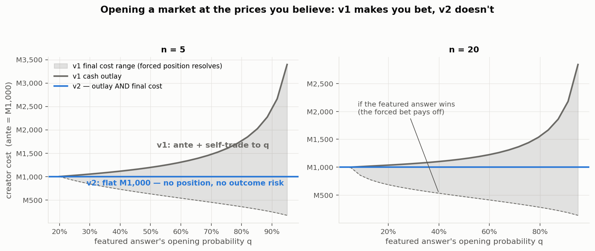
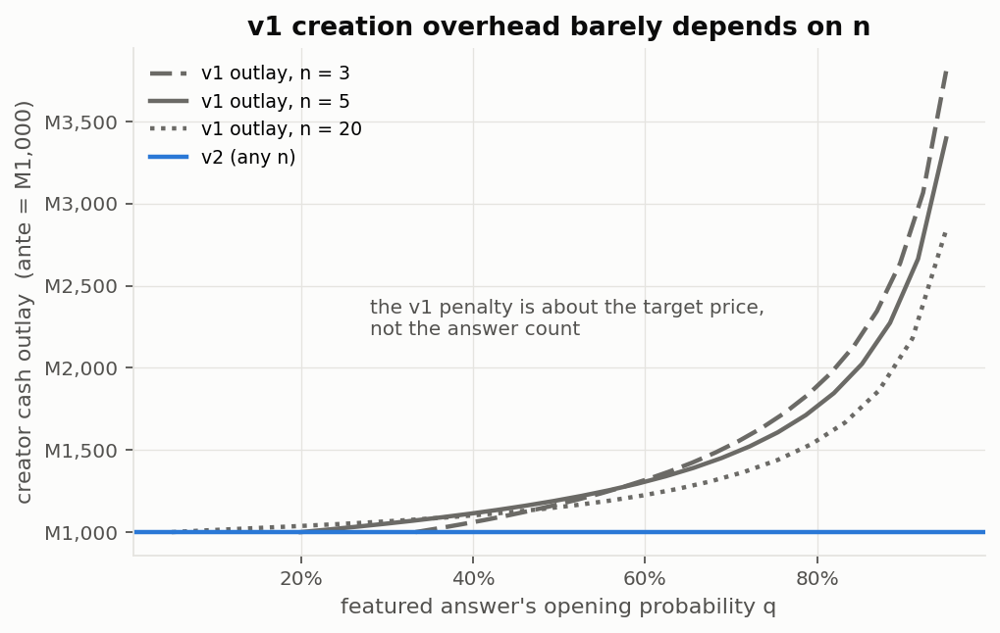
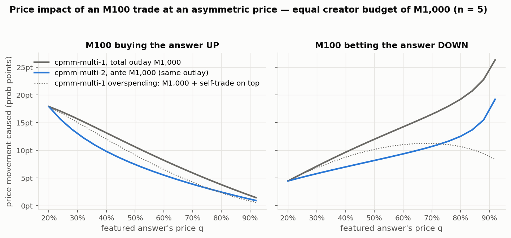
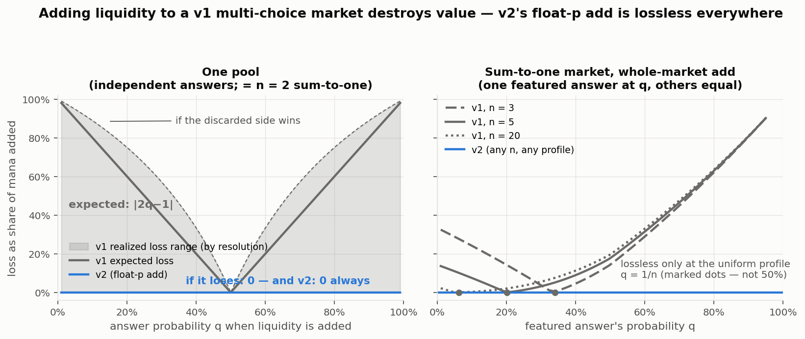
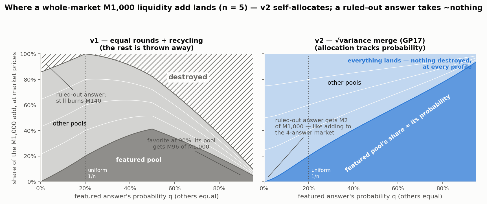
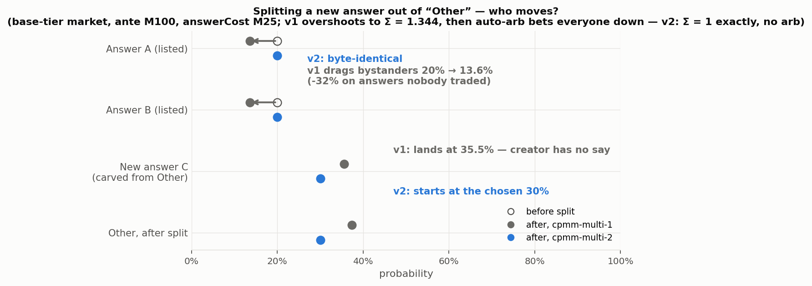
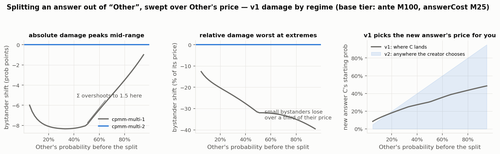

# `cpmm-multi-2` — Rationale & Evidence Bundle

*The upstream pitch for a second multi-choice market mechanism: what it fixes, why it's safe,
and the machine-checked evidence behind every claim. It links the full paper, the executable
proofs, and the reference implementation that back it.*

> **About this copy.** This is the evidence-bundle edition of the rationale. Paths below are
> **relative to this directory** (`paper/`, `proofs/`, `reference/manifold/`, `tests/`). A few
> references point at the Manifold implementation PR or the author's working monorepo (the full
> pytest suite, internal design docs); those are noted inline and are not part of this bundle.

---

## TL;DR

`cpmm-multi-1` (Manifold's sum-to-one multi-choice market) has three long-standing
limitations that all trace to **one missing degree of freedom**: a multi-choice answer
has no per-answer `p`, the way a binary `cpmm-1` market does. Adding it — defaulting to
`0.5` when absent, so every existing market is unchanged — unlocks fixes for all three at
once. (A direct-formula auto-arb that's asymptotically faster comes along for free, but
that's a *secondary* benefit — server-side arb compute was never the bottleneck; DB/IO is.
The direct formulas earn their place by being the clean, **exact, reversible** core that
problems 2 and 3 require, not by shaving milliseconds.)

We are **not** asking to change `cpmm-multi-1`. We freeze it bug-for-bug and put every
breaking change behind a new mechanism, `cpmm-multi-2`, that a market opts into. A
`cpmm-multi-1` market *is* a `cpmm-multi-2` market with every `p_i = 0.5` — so conversion
is lossless in state and can happen lazily, one market at a time, with trivial rollback.

What we bring to the table (this is the part that matters — a paper alone doesn't merge):

1. **A paper** — `docs/auto-arb-algorithms.tex` — deriving the three direct-formula
   auto-arb algorithms and the general-`p` cost core.
2. **Machine-checked proofs** — `tasks/cpmm_multi_2/proofs/` — GP1–GP11, symbolic
   (sympy) + numerical, each runnable standalone.
3. **A reference implementation** — `manifold/closed_form_arb.py` — the three
   parameterizations written fresh from the theorems, ready to port to TypeScript.
4. **Differential anchors against Manifold itself** — the reference path reproduces
   Manifold's own solver, and a real captured Manifold bet, to machine precision (GP8).

---

## The three problems

### 1. Auto-arb is O(n log² N)

The current multi-choice auto-arbitrage (`calculate-cpmm-arbitrage.ts`) is a nested binary
search: an outer search for the equilibrium scale `η`, where **every probe** inverts
cost↔shares with a second inner binary search (`calculateCpmmAmountToBuySharesFixedP`).

The paper shows the inner search is unnecessary. The per-answer cost legs have **direct
O(1) closed forms** (in the cost-in direction for any `p`; closed-form both directions at
`p=0.5`), collapsing the cost from O(n log² N) to **O(n log N)**.

**Why this matters is *not* primarily speed.** Server-side arb compute is dwarfed by DB/IO
in production, so the asymptotic win is a bonus, not the motivation. The real value: a
direct closed-form cost curve is the clean, exact core that generalizes off `p=0.5`
(problem 3) and that the reversible-fill fix (problem 2) settles onto. So we are not
pitching a perf rewrite for its own sake; we are replacing the nested search with the
closed-form core the next two fixes build on. (A purely-for-speed retrofit of the closed
form onto *v1's* no-limit path is possible and provably behavior-identical, but we **leave
it out** — the compute it saves isn't worth the added surface.)

### 2. Resting limit orders get transient-overshoot fills during multi-leg auto-arb

A multi-answer buy (and the add-answer bet-down) overshoots `Σp > 1`, then the auto-arb
bets it back down. If a resting limit sits in that overshoot band, it is **consumed on the
way up and kept on the way down** — filled even though the answer's price ends up *below*
the limit, so neither the price before nor after the trade ever reaches it. The maker is
charged for a fill the net trade never justified.

This is **empirically confirmed against current Manifold** by a runnable test
(`tasks/cpmm_multi_2/vendor-probes/`): on the multi-buy path a NO maker priced *above* both
the initial and final probability is filled for 14–26 mana across configs. The
**single-answer buy is monotone and does not** exhibit it (control passes) — so the fix is
scoped to the overshoot paths only.

The v2 fix is **net-movement settlement** (a temporary reverse limit at the crossed price
that a down-move re-crosses for an exact refund), giving the stronger, less-surprising
contract "you fill when price *reaches* your limit." It also makes the cost curve a state
function — `C(δ) + C(−δ) = 0` across limits — which is what lets the direct-formula path be
exact even when limits are present.

*(Note: this is a **fill-semantics** change, not a fix for a broken search. Vendor's auto-arb
search is already path-independent — `applyMakersToWorkingState` is copy-on-write, so probes
don't corrupt each other. The behavior we change is what happens to a maker transiently
crossed during the real multi-leg execution.)*

The fix is **reversible (net-movement) settlement**: a maker crossed during the atomic op
leaves a *temporary reverse limit* at the same price, which a down-probe re-crosses first
(price priority) for an exact refund. The consumed amount of every maker becomes a pure
function of price, so taker cash is a potential `Φ(p)` and `cash(a→b) = Φ(b) − Φ(a)` — a
state function. Reversibility and path-independence become identities, not approximations.
At commit, the reverse limits vanish, leaving exactly the makers crossed by the *net* δ.

**This is a behavior change** (a resting order fills when price *reaches* its limit, rather
than on transient overshoot), so it cannot go on `cpmm-multi-1` silently. It rides in v2.

### 3. `p = 0.5` is hardcoded

Multi-choice pools are pinned to `p = 0.5`, which blocks two features binary markets
already have:

- **Non-uniform initialization.** Every answer starts at `1/n`; there's no `initialProb`.
- **Lossless liquidity addition.** `addCpmmLiquidityFixedP` *throws shares away* to hold
  probability on an asymmetric pool (`sharesThrownAway`), because at fixed `p=0.5` you
  physically cannot deepen a skewed pool without moving price.

What these cost real users, in pictures (all scenario numbers at Manifold's default
liquidity tiers; every figure is generated by an asserting script in
[`figures/`](figures/README.md) that computes through the reference implementation):

**Creators pay extra and are forced into a position.** To open a 5-answer market with one
answer at 90%, a v1 creator pays M2,274 (ante + forced self-trade) and ends up with an
outcome gamble — final cost anywhere in [M262, M2,274] depending on how the forced bet
resolves. A v2 creator pays the M1,000 ante, holds no position, and is done — at any
target profile, and nearly independent of the answer count:

**Traders get a thinner market per mana of subsidy.** At equal creator budget, the v1
market is easier to move than the v2 market in *both* directions at every asymmetric
price (at q = 0.9, an M100 bet-down moves v1 by 22.8pt vs v2's 15.5pt):

**Liquidity providers have their mana destroyed.** A single fixed-p pool discards
|2q−1| of an add in expectation — M800 of M1,000 at a 90% answer. The sum-to-one
whole-market add partially recycles, but is lossless *only* at the exactly-uniform
profile (for n > 2 the safe point is 1/n, not 50%): a 90%-answer profile still burns
M807 of M1,000 in EV. v2's float-p add is identically lossless everywhere:

**And what survives lands in the wrong pools.** Valuing each pool's reserve delta at market
prices: at a 90% favorite, only M96 of a v1 M1,000 add reaches the favorite's pool (the M807
above is destroyed outright) — and even in the "safe-looking" direction, a market with one
*ruled-out* answer still burns M140. v2's whole-market add (the √variance merge, GP17 —
creation's own allocation rule applied to the added mana) is lossless everywhere and
self-allocating: each pool's share tracks its probability, so a ruled-out answer attracts
~nothing (M2 of M1,000 at q = 0.5%). Subsidizing a market with a dead answer is, in value
terms, subsidizing the live answers — LPs don't need to think about it:

---

## The key design realization

Binary `cpmm-1` already represents a non-50% market with a balanced, deep pool by setting
`p = initialProb`. Multi-choice can't — there's no `p` field on `Answer`/`CPMMMulti`, so
it's pinned to uniform `1/n`. **Give each answer its own `p`, exactly like binary already
has**, and both `p=0.5` limitations dissolve:

- **Non-uniform init** — set `p_i`, normalize Σ = 1.
- **Lossless liquidity add** — inject mana equally into both reserves and let `p_i` float
  to hold probability. The invariant that "gives" is *`p_i` held constant*, not
  *probability preserved* — `p_i` is precisely the DOF that moves to absorb mana losslessly.

Per-answer `p` also matches the "any `p`" generality the paper already assumes, and makes
the "Other"-split path (carving a new answer out of the catch-all) clean: set the new
answer's `p` to its target probability and Other's `p` to the remainder, leaving the listed
answers' probabilities exactly unchanged (vs. v1, which perturbs them via excess-share
dumping + a cleanup arb pass).

The bystander damage is not hypothetical. On a default base-tier market with Other at
60%, v1's add-answer path drags the listed answers from 20% to 13.6% — a −32% move on
answers nobody traded — and the new answer *lands* at 35.5%, wherever the pool surgery
puts it; the creator never chooses its starting price. v2 leaves bystanders
byte-identical and starts the new answer exactly where asked:

Swept over Other's price, the absolute damage peaks mid-range (where the transient
Σ-overshoot maxes out at 1.5), the *relative* damage is worst at the extremes, and —
because a traded market's pools are shallowest at the uniform point — the realistic
worst case sits right around `q_Other ≈ 1/n`:

---

## Architecture: freeze v1, gate everything breaking in v2

- **`cpmm-multi-1` stays frozen** — untouched, bug-for-bug. Every live market and every
  integrator's current forecasts keep working.
- **`cpmm-multi-2` = `cpmm-multi-1` + per-answer `p` + reversible-limit auto-arb +
  direct-formula core.** New markets opt in. The closed-form path is *fully exact* here
  (reversible ⇒ direct formulas exact even with limits).
- **Deliberately out of scope: retrofitting the closed form onto v1.** It's provably
  identical to the v1 nested search on the no-limit case, so it *could* be delivered to all
  markets with zero behavior change — but the only thing it buys is server-side compute,
  which is dwarfed by DB/IO. We note it as a future option and leave it out for conciseness.

### Migration: lazy, no big-bang

A `cpmm-multi-1` market is a `cpmm-multi-2` market with every `p_i = 0.5` — same pools,
same probabilities. So:

- **Default `p` to 0.5 when absent** (`p ?? 0.5` at every read). Legacy rows store no `p`;
  the field is written lazily the first time a market converts. Storage *and* behavior
  migrate in the normal write path, one market per transaction — no migration window,
  trivial rollback (stop converting), conversion code exercised continuously.
- **Trigger = explicit user `addLiquidity`**, not the automatic subsidy drizzle. Lossless
  add = moving `p` off 0.5, so the first real add *is* the conversion. Don't let the
  scheduler flip semantics under resting orders.
- **Version flip must be API-visible** — conversion is a discrete, observable event (the
  add txn bumps the version), so integrators detect it and switch models. The line to hold:
  *behavior never changes without the version field changing.*
- **Resting limits need no special handling.** Conversion changes no already-executed fill,
  and lossless add preserves probability (so it doesn't move price relative to any resting
  limit). Orders simply continue under v2 rules. The one RFC line item for maintainers:
  "we never promised transient-overshoot fills" is a judgement call about *Manifold's*
  users' orders, not ours to make unilaterally.

---

## Evidence bundle

Every claim above is backed by a runnable proof or a differential test. The proof scripts
are self-contained (sympy + numpy; no project-local imports) and are meant to be hosted in
a citable location alongside the PR. The differential tests live with the reference
implementation.

| Claim | Theorem | Proof / test |
|---|---|---|
| Probability read `prob = pN/((1−p)Y+pN)`; invariant `k=Y^p·N^(1−p)`; both reduce at p=½ | **GP1** | `proofs/general_p_cost.py` |
| Cost-in (spend amount A) is **closed-form O(1) for any p** | **GP2** | `proofs/general_p_cost.py` |
| Shares-in is closed-form **only at p=½** (transcendental otherwise; no Lambert-W; p=1/5 has Galois group S₅) ⇒ parameterize in the cost-in direction, residual = bounded Newton | **GP3** | `proofs/general_p_cost.py` |
| Pure-CPMM cost is a state function ⇒ reversible `C(+)+C(−)=0` for any p (convention A: reverse acts on the same pool side) | **GP4** | `proofs/general_p_cost.py`, `tests/test_slice3_reversibility.py` |
| Equilibrium η **exists and is unique** for any p; `sign(η)=sign(Σp−1)` | **GP5a** | `proofs/equilibrium.py` |
| General-p arb leg is a bounded, monotone, convex 1-D inversion; Newton from the p=½ seed clears it in **≤5 steps**; solver hits Σp=1 to <1e-10 | **GP5c** | `proofs/equilibrium.py` |
| The `η·(n−1)` complete-set redemption value is outcome- and p-independent (risk-free) ⇒ one monotone root ⇒ single bisection to machine precision; v1's leftover-mana loop **dissolves** | **GP5d** | `proofs/equilibrium.py` |
| `p* = qY/(qY+(1−q)N)` makes any reserves show any target prob `q` — the DOF a fixed-½ pool lacks | **GP6a** | `proofs/other_split.py` |
| Lossless "Other" split: listed probs exactly unchanged, Σp=1 exact, reserves conserved (vs. v1 perturbing listed answers ~3 pts and overshooting Σ≈1.20) | **GP6b/c** | `proofs/other_split.py` |
| Reversible limits via temporary reverse orders: round-trip cash = exactly 0; fuzz 400 books × trajectories = 0 spread; conservative on no-overshoot searches | **GP7a–d** | `proofs/reversibility_limits.py` |
| Direct closed-form path == Manifold's nested-search solver on p=½/no-limit (worst **2.8e-13 shares / 2.4e-11 pools**); matches a **real captured Manifold bet** to **rel 6.6e-13** | **GP8** | `closed_form_arb.py`, `tests/test_gp8_direct_equivalence.py` |
| Pure-CPMM reverse **is** Theorem 9 (buy-opposite + redeem) at any p — one sell primitive, no second convention | **GP9** | `proofs/general_p_cost.py`, `tests/test_slice3_reversibility.py` |
| The three parameterizations (dollar / share / probability-centric) are **one trade in three coordinates** — identical (shares, cost, prob) + pools; redemption bookkeeping is a relabeling | **GP10** | `proofs/parameterization_equivalence.py`, `tests/test_slice4_parameterizations.py` |
| v2 is the exact `Σp=1` root that v1's `while(amountToBet>0.01)` loop truncates: v1(τ)→v2 monotonically (v2 Σp=1 to **2.2e-16**); the v1-vs-v2 share gap = the unreinvested-tail value, `gap/(0.01/price)=1.000` (asymptotically exact) ⇒ gate tolerance `0.01/price`, not an epsilon | **GP11** | `proofs/truncation_residual.py` |

Index with full statements and status: `tasks/cpmm_multi_2/proofs/theorems_summary.md`.

### The reference implementation

`manifold/closed_form_arb.py` exposes the three parameterizations from the paper, written
**fresh** from the GP theorems (not wrappers over an existing solver — so the differential
tests cross-check two independent implementations of the same math):

- `calculate_purchase_with_arbitrage_direct` — dollar-centric (cost in)
- `calculate_shares_with_arbitrage_direct` — share-centric (shares in)
- `calculate_probability_with_arbitrage_direct` — probability-centric (target prob in)

Each is independently anchored to a production solver at p=0.5 (dollar ↔ the nested-search
solver per GP8; share ↔ `calculate_shares_exact`; prob ↔ `buy_to_probability`), all to
~1e-10 or better. This is the surface PR2 ports to upstream TypeScript.

### Why the proofs carry the weight where there's no oracle

There's a hard asymmetry in what can be tested:

- **At p = 0.5** there are two oracles — the vendor source *and* the live API dry-run — so
  the direct path is validated differentially (GP8). This is the regression anchor.
- **At p ≠ 0.5** there is **no oracle** (the current code throws on p≠0.5; no such market
  exists to mint ground truth). So the novel math is validated by **internal consistency**:
  invariant preservation, the p→0.5 limit recovering the known closed form, reversibility,
  uniqueness, and Σp=1 — the properties *are* the validation. An absent oracle is not a
  passing one; the proofs do the whole job there, which is why they're symbolic where they
  can be.

---

## PR decomposition

**PR1 — foundation (non-breaking, not wired into any live bet path).** New, pure,
well-tested functions; no behavior change; no user-visible change. The reference
implementation + proofs + tex update above. *Complete in prototype form.*

**PR2 — the `cpmm-multi-2` mechanism (breaking, fully gated).** Staged so merge order is
decoupled from release via a feature flag (a `p ?? 0.5` read default *is* the flag):

- **PR2a** — storage migration (`p` on every answer, nullable default 0.5) +
  read/display-compat (`getCpmmProbability(pool, p_i)` everywhere). *Invisible — all p
  still 0.5 when it ships.*
- **PR2b** — backend v2 semantics: reversible-limit auto-arb (buy + sell), lossless
  liquidity add, the direct-formula fast path. *Inert — no creation path yet, so no v2
  market can exist.*
- **PR2c** — creation: `createMultiSchema` accepts per-answer `initialProb` (normalize
  Σ=1), web creation UI, behind a feature flag flipped on last. **Gate at the schema/API
  level, not just the UI** — the API is public.

A precise site-by-site checklist (which sites are free once `p` is threaded vs. genuinely
new code) lives in `tasks/cpmm_multi_2/onboarding.md` under "API + UI change checklist".

---

## Open questions for maintainers (RFC)

These are the things worth settling *before* heavy TypeScript work:

1. **Appetite for a whole new mechanism — settled: yes, a new `cpmm-multi-2` mechanism
   string** (discussed with maintainers). We considered gating on a `p`/`version` field on
   `cpmm-multi-1` instead, but a distinct mechanism gives a clean type-level boundary and
   keeps v1 provably frozen. (We also rejected accepting reversibility as a bugfix on v1
   directly — it changes already-relied-upon fills.) Recorded here as the decision the rest
   of the plan builds on.
2. **The transient-overshoot fill promise.** v2's reversible rule is the *stronger*
   contract ("you fill when price reaches your limit"). At conversion, resting limit orders
   move to the v2 rule (they don't get grandfathered into v1's transient-overshoot fills).
   Confirming no one is entitled to those transient fills is a maintainer judgement — flagged
   for your agreement, not a design question.
3. **"Add answer" as a conversion trigger** alongside `addLiquidity` — **settled: yes.**
   Same family (injects mana, restructures pools), strictly cleaner under v2. Note: v1
   add-answer doesn't *waste* mana, but it perturbs unrelated listed answers' prices (when
   "Other" is high-probability) and runs a needless bet-down arb; v2 (GP6) makes the split
   clean and non-surprising.
4. **v1↔v2 equivalence is *not* bit-exact, by design — and v2 is the more correct of the
   two.** v1's multi-answer arb is an iterate-buy-arb-reinvest loop that stops with up to
   **0.01 mana** of redemption left unreinvested (`while (amountToBet > 0.01)`); v2's direct
   path drives the equilibrium to the exact `Σp = 1` root — it *is* the `0.01 → 0` limit of
   v1's own iteration. So v2 buys marginally more shares than v1 on the same input. We
   validate v2 on its own terms (invariant preservation + `Σp = 1` to machine precision), and
   set the v1↔v2 no-limit equivalence-gate tolerance to a **numerical-analysis bound on v1's
   truncation residual** — proven in **GP11** (`proofs/truncation_residual.py`): the share gap
   equals the unreinvested-tail value, measured `gap/(0.01/price) = 1.000` (asymptotically exact,
   since the recycle fraction → 0 at the tail), so the per-case gate is `|Δshares| ≤ 0.01/(YES
   price sum)` — bounded and data-dependent, not an arbitrary epsilon. *(The GP8 machine-precision
   anchor is v2 vs. our own already-exact reference solver, which has no 0.01 loop — a different
   comparison.)*

---

## Pointers

- **Paper:** [`paper/auto-arb-algorithms.pdf`](paper/auto-arb-algorithms.pdf) (TeX source
  alongside) — three algorithms, general-p cost, reversibility.
- **Proof index:** [`proofs/theorems_summary.md`](proofs/theorems_summary.md) (GP1–GP18).
- **Reference impl:** [`reference/manifold/closed_form_arb.py`](reference/manifold/closed_form_arb.py).
- **Differential anchor:** [`tests/test_gp8_direct_equivalence.py`](tests/test_gp8_direct_equivalence.py)
  — reproduces Manifold's solver and a real captured bet to ~`1e-13`.
- **The mechanism implementation** lives in the Manifold PR (the upstream TypeScript port that
  this bundle backs). The existing-coverage context (Theorem EQ, S3/S4/S10), the §8 limit-order
  caveat in prose, and the full design/migration/site checklist live in the author's monorepo
  and are summarized in this document.
